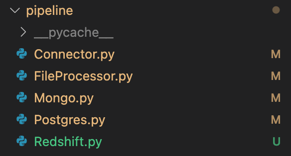
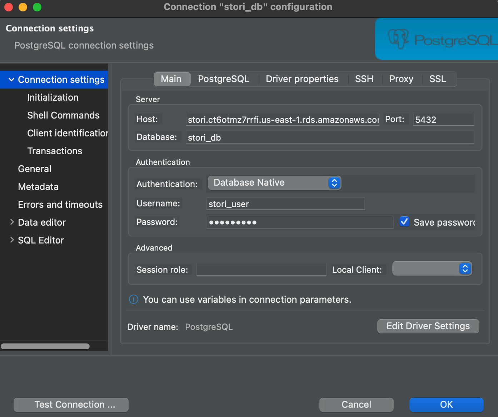
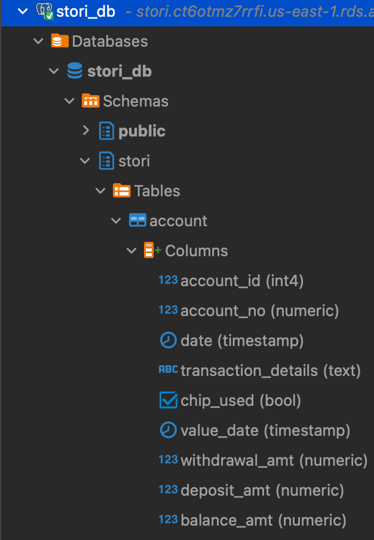
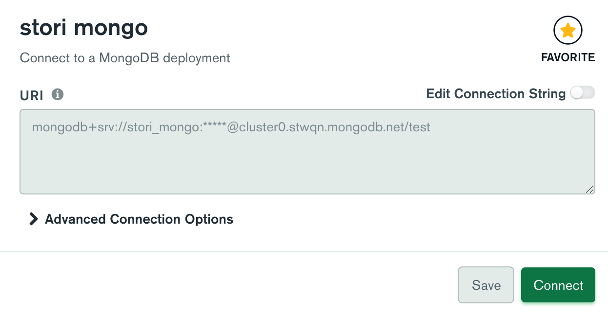
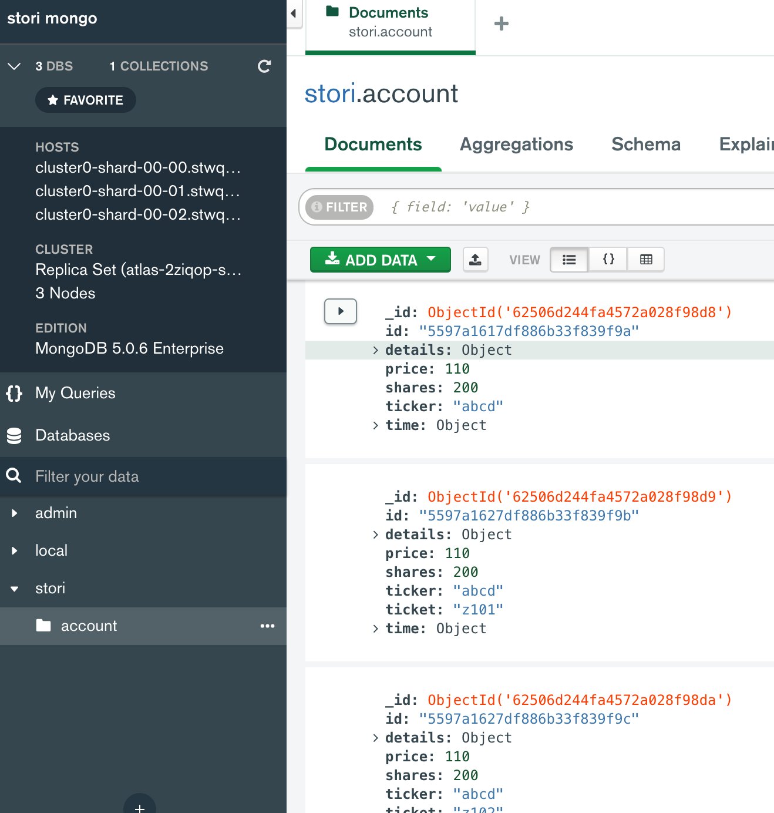
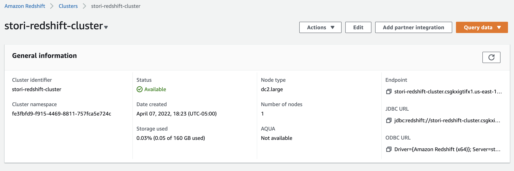
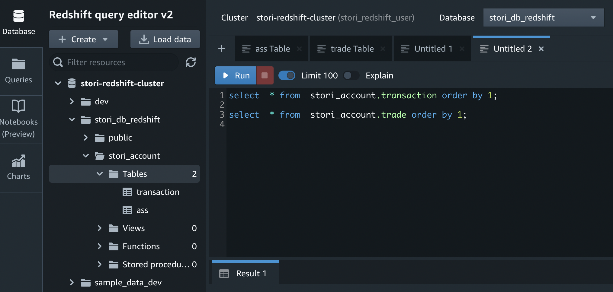

# Code Challenge: Stori Tech Challenge

For this challenge, you are tasked with creating a simple data pipeline to copy data from various data sources to a data warehouse. The pipeline should run on a schedule and copy over data that has been either inserted or updated in the data sources since the last pipeline run.

The data warehouse should consist of a small Redshift cluster (you can use a dc2.large for .25c/hr and shut it down when not using it). Both a SQL database and a NoSQL database should be used as data sources. You can choose whichever databases you'd like for these; but you must import the data we've provided.

The guidelines for the pipeline itself are intentionally open-ended and the pipeline can be implemented using whichever tools you choose. We just ask that you use AWS as a cloud provider for any cloud services you leverage. Once you are finished building the pipeline, please commit all code and relevant files to GitHub.

# Discussing

For the solution that i've been implemented, i've divided in 3 main classes 2 with all the logic to get the data from the 2 source and the other with the logic to upload to redshift cluster. Also i use two aux classes that help with the files and the connection. I did it this way because it will be easier to keep it simple.



### Reasoning

The programming language chosen for this solution was python because it makes easier the integration with AWS services. Also is the language that i use currently.

In the specification file mentioned that we can use any SQL and NoSQL so i used a Postgres Database and MongoDB Database, created only for this challenge in RDS for postgres and Mongo Atlas for MongoDB.

Postgres





MongoDB





Redshift Cluster





## Instructions

For the right way to run the application we need python i use the following version

```bash
Python 3.9.10
```

In case we don't have python installed we can download it from [Python Download 3.9](https://www.python.org/downloads/release/python-3911/)

Also we have to run the following command to get all the libraries that we need

```bash
pip install -r requirements.txt  
```

And that's all we need.

## Execution

For the correct execution of the application we use the terminal and with the following commands

For Mongo Source

```bash
 python3 pipeline/Mongo.py
```

For Postgres Source

```bash
 python3 pipeline/Postgres.py
```
# Extras

In addition with the previous i've implemented a lambda function triggered with S3 bucket so when we put or post a file into the bucket this get trigger the action that copies the parquet files into the redshift cluster.

[Video Lambda Function](https://drive.google.com/drive/folders/1_OWp9-_XHCwnynIgwZPxYfsWttld8k0v)

## Documentation

* [Python 3.9](https://docs.python.org/3.9/)
* [Postgresql](https://www.postgresql.org/docs/)
* [MongoAtlas](https://www.mongodb.com/docs/atlas/)
* [MongoDB](https://www.mongodb.com/)
